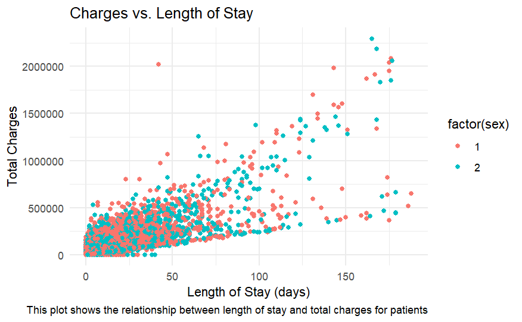
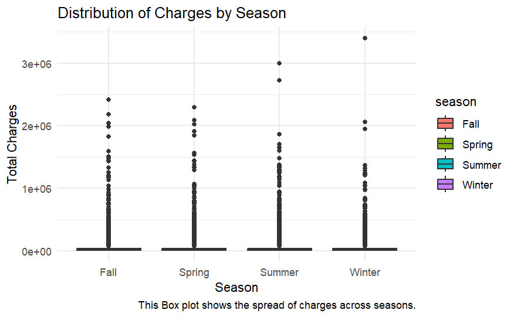

---
title: "RI DOH Data Analysis"
author: <font size="5"> Todd DiLullo </font>
output:
  xaringan::moon_reader:
    css: [default, metropolis, metropolis-fonts]
    lib_dir: libs
    nature:
      highlightStyle: github
      highlightLines: true
      countIncrementalSlides: false
      slideNumberFormat: |
        <div class="progress-bar-container">
          <div class="progress-bar" style="width: calc(%current% / %total% * 100%);">
          </div>
        </div>`
---

<style>

.remark-slide-content {
  background-color: #FFFFFF;
  border-top: 80px solid #F9C389;
  font-size: 17px;
  font-weight: 300;
  line-height: 1.5;
  padding: 1em 2em 1em 2em
}

.inverse {
  background-color: #696767;
  border-top: 80px solid #696767;
  text-shadow: none;
  background-image: url(https://github.com/goodekat/presentations/blob/master/2019-isugg-gganimate-spooky/figures/spider.png?raw=true);
	background-position: 50% 75%;
  background-size: 150px;
}

.your-turn{
  background-color: #8C7E95;
  border-top: 80px solid #F9C389;
  text-shadow: none;
  background-image: url(https://github.com/goodekat/presentations/blob/master/2019-isugg-gganimate-spooky/figures/spider.png?raw=true);
	background-position: 95% 90%;
  background-size: 75px;
}

.title-slide {
  background-color: #F9C389;
  border-top: 80px solid #F9C389;
  background-image: none;
}

.title-slide > h1  {
  color: #111111;
  font-size: 40px;
  text-shadow: none;
  font-weight: 400;
  text-align: left;
  margin-left: 15px;
  padding-top: 80px;
}
.title-slide > h2  {
  margin-top: -25px;
  padding-bottom: -20px;
  color: #111111;
  text-shadow: none;
  font-weight: 300;
  font-size: 35px;
  text-align: left;
  margin-left: 15px;
}
.title-slide > h3  {
  color: #111111;
  text-shadow: none;
  font-weight: 300;
  font-size: 25px;
  text-align: left;
  margin-left: 15px;
  margin-bottom: -30px;
}

</style>

<style>
img {
  max-width: 50%;
  height: auto;
}
</style>
```{css, echo=FALSE}
.left-code {
  color: #777;
  width: 48%;
  height: 92%;
  float: left;
}
.right-plot {
  width: 51%;
  float: right;
  padding-left: 1%;
}
```

```{r setup, include = FALSE}

# R markdown options
knitr::opts_chunk$set(echo = TRUE, 
                      
                      fig.width = 10,
                      fig.height = 5,
                      fig.align = "center", 
                      message = FALSE,
                      warning = FALSE)

# Load packages
library(tidyverse)
```

# Charges vs Length of Stay

```{r, eval=FALSE}
library(tidyverse)
library(lubridate)
library(knitr)
df %>% filter(los <200, sex ==1|sex == 2) %>% ggplot()+
  geom_point(mapping = aes(x = los, y = total, color = factor(sex)))+
  labs(title = "Charges vs. Length of Stay", x = "Length of Stay (days)", y = "Total Charges", caption = "This plot shows the relationship between length of stay and total charges for patients") +
  theme_minimal()
```

---
# Total Charges By Age Group

```{r, eval=FALSE}
df <- df %>%
  filter(sex ==1|sex == 2) %>% 
  mutate(age_group = case_when(
    age < 20 ~ "Under 20",
    age >= 20 & age < 40 ~ "20-39",
    age >= 40 & age < 60 ~ "40-59",
    age >= 60 ~ "60+"
  ))

df %>%  ggplot() +
  geom_boxplot(aes(x = age_group, y = total, color = factor(sex))) +
  labs(title = "Total Charges by Age Group", x = "Age Group", y = "Total Charges", color = "Sex", caption = "This box plot shows the relationship between different age groups and total charges") +
  theme_minimal()
```

---
# Charges By Provider

```{r, eval=FALSE}
total_by_provider <- df %>%
  group_by(provider) %>%
  summarize(total_charge = sum(total, na.rm = TRUE)) %>%
  arrange(desc(total_charge))

ggplot(total_by_provider, aes(x = reorder(provider, total_charge), y = total_charge)) +
  geom_bar(stat = "identity", fill = "skyblue") +
  coord_flip() +
  labs(title = "Total Charges by Provider", x = "Provider", y = "Total Charges",caption = "This plot shows the total charges by each provider of care") +
  theme_minimal()
```


---
# Patient Age Distribution

```{r, eval=FALSE}
ggplot(df, aes(x = age)) +
  geom_histogram(binwidth = 5, fill = "steelblue", color = "black") +
  labs(title = "Age Distribution of Patients", x = "Age", y = "Count", caption = "This plot shows the distribution between the different age groups of patients") +
  theme_minimal()
```

---
# Distribution of Patients by Gender
```{r, eval=FALSE}
gender_distribution <- df %>%
  group_by(sex) %>%
  summarize(count = n())

# Bar plot
ggplot(gender_distribution, aes(x = factor(sex), y = count, fill = factor(sex))) +
  geom_bar(stat = "identity") +
  scale_x_discrete(labels = c("Male", "Female")) +
  labs(title = "Gender Distribution of Patients", x = "Gender", y = "Count", caption = "This plot shows the distribution between male and female patients") +
  theme_minimal()
```

---
# Distribution of Charges by Season
```{r, eval=FALSE}
df %>%
ggplot (aes(x = season, y = total, fill = season)) +
geom_boxplot() +
labs( title = "Distribution of Charges by Season", x = "Season", y = "Total Charges", caption = "This Box plot shows the spread of charges across seasons.") +
  theme_minimal()

```

---
# Average Length of Stay by Providers
```{r, eval=FALSE}
avg_los_by_provider <- df %>%
  group_by(provider) %>%
  summarize(avg_los = mean(los, na.rm = TRUE)) %>%
  arrange(desc(avg_los))

# Plot
ggplot(avg_los_by_provider, aes(x = reorder(provider, avg_los), y= avg_los)) +
  geom_bar(stat = "identity", fill = "darkblue") +
  coord_flip() +
  labs(title = "Average Length of Stay by Provider",x = "Provider",y = "Average Length of Stay (days)",caption = "This plot Shows the variation in average LOS across providers.") +
  theme_minimal()
```

---
# Length of Stay by Gender and Age Group

```{r, eval=FALSE}
ggplot(df %>% 
         filter(los < 200) %>% 
         mutate(age_group = cut(age, breaks = c(0, 20, 40, 60, 80, 100), right = FALSE)), 
       aes(x = age_group, y = los, fill = factor(sex))) +
  geom_boxplot(outlier.color = "red", alpha = 0.7) +
  scale_fill_manual(values = c("blue", "pink"), labels = c("Male", "Female")) +
  labs(title = "Length of Stay (< 200 Days) by Gender and Age Group",x = "Age Group",y = "Length of Stay (LOS)",fill = "Gender",caption = "This Box plot shows LOS under 200 days grouped by gender and age ranges.") +
  theme_minimal()
```

---
# Average Total Charges by Gender
```{r, eval=FALSE}
avg_charges_by_gender <- df %>%
  group_by(sex) %>%
  summarize(avg_total = mean(total, na.rm = TRUE))

# Bar plot
ggplot(avg_charges_by_gender, aes(x = factor(sex), y = avg_total, fill = factor(sex))) +
  geom_bar(stat = "identity", alpha = 0.7) +
  scale_fill_manual(values = c("blue", "pink"), labels = c("Male", "Female")) +
  labs(title = "Average Total Charges by Gender",x = "Gender",y = "Average Total Charges",fill = "Gender",caption = "This Bar plot shows the average total charges for males and females.") +
  theme_minimal()
```


---
# Average LOS in Different MOA
<div style="font-size: 60%;">
```{r, eval=FALSE, class.output="small-output"}
library(gganimate)
df %>%
  group_by(moa, sex) %>%
  summarize(avg_los = mean(los, na.rm = TRUE), .groups = "drop") %>%
  ggplot(aes(x = moa, y = avg_los, color = factor(sex))) +
  geom_line(size = 1.2) +  
  geom_point(size = 3) +  
  geom_text(aes(label = round(avg_los, 1)), vjust = -1, size = 4) + 
  scale_color_manual(values = c("blue", "pink"), labels = c("Male", "Female")) +
  labs(title = "Average Length of Stay In Different Months of the Year",
    subtitle = "Month of Admission: {frame_along}",
    x = "moa",
    y = "Average Length of Stay (LOS)",
    color = "Gender",
    caption = "This Animation shows trends in average LOS by gender in different months of the year.") +
  theme_minimal() +
  transition_reveal(moa)
```
</div> 


---
# First Target Model Comparison

```{r, eval=FALSE}
# Based on Target of High or Low Total Charges
trControl = trainControl(method = "cv",
                         number = 5)
tree <- train(target~., data=df2_train, 
                                method = "rpart2", 
                                trControl = trControl)
forest_ranger <- train(target~., data=df2_train, 
                    method = "ranger", 
                                trControl = trControl)
results <- resamples(list('Decision Tree' = tree,
                          'Random Forest' = forest_ranger))
bwplot(results)
```

---
# Final Model Pick for First Target

```{r, eval=FALSE}
# Final Selection for the Model is the Random Forest model. 
library(caret)
pred <- predict(forest_ranger, df2_test)

cm <- confusionMatrix(data = pred, reference = df2_test$target, positive = "high")

cm$overall[1]
```

---
# Creating New Target Variable

```{r, eval=FALSE}
# Create Target Variable
df3 <- df3 %>%
  mutate(target = ifelse(age < 50 , "Young", "Old"))
table(df3$target)
# Input Variables
df3 <- df3 %>%
  select(sex, raceethn, provider, moa, mod, admtype, campus,total,los, target)
```
 
---
# Set Testing and Training

```{r, eval=FALSE}
library(tidyverse)
library(caret)
df3 <- df3 %>%
  filter(raceethn != '' & !is.na(raceethn) & admtype != '' & !is.na(admtype))

df3 <- df3 %>% 
  mutate(target = as.factor(target),
         raceethn = as.factor(raceethn),
         sex = as.factor(sex), 
         provider = as.factor(provider), 
         campus = as.factor(campus),
         admtype = as.factor(admtype), 
         moa = as.factor(moa), 
         mod = as.factor(mod),
         total = as.numeric(total))
splitIndex <- createDataPartition(df3$target, p = .10, 
                                  list = FALSE)
df3_train <- df3[ splitIndex,]
df3_test <- df3[-splitIndex,]
```
---
# Training Decision Tree using Rpart

```{r, eval=FALSE}
library(rpart)
tree2<-rpart(target ~ ., 
            data = df3_train,
            control=rpart.control(maxdepth=2))
# Plot the tree
library(rattle)
fancyRpartPlot(tree2)
```


---
# Using Caret to Train & Tune Models

```{r, eval=FALSE}
#Rpart2
tuneGrid = expand.grid(maxdepth = 2:10)
trControl = trainControl(method = "cv",
                         number = 5)
tree_approach3 <- train(target~., data=df3_train, 
                                method = "rpart2", 
                                trControl = trControl,
                                tuneGrid = tuneGrid)
```

---
# Second Caret Model
```{r, eval=FALSE}
trControl = trainControl(method = "cv",
                         number = 5)
tuneGrid = expand.grid(mtry = 3,
                       splitrule = c('gini', 'extratrees'),
                       min.node.size = c(10))
forest_ranger2 <- train(target~., data=df3_train, 
                    method = "ranger", 
                    trControl = trControl,
                    tuneGrid = tuneGrid)
```

---
# Model Comparison for Second Target


---
# Model Comparison

Comparing Decision Tree and Random Forest 

```{r, eval=FALSE}
trControl = trainControl(method = "cv",
                         number = 5)
tree2 <- train(target~., data=df3_train, 
                                method = "rpart2", 
                                trControl = trControl)
forest_ranger2 <- train(target~., data=df3_train, 
                    method = "ranger", 
                                trControl = trControl)
results <- resamples(list('Decision Tree' = tree2,
                          'Random Forest' = forest_ranger2))


bwplot(results)
```

---
# Model Comparison


---
# Final Model

- The comparison shows that random forest using `ranger` package is the best option  

- Now we need to evaluate the model on the test data

```{r, eval=FALSE}
pred <- predict(forest_ranger2, df3_test)

cm <- confusionMatrix(data = pred, reference = df3_test$target, positive = "Old")

cm$overall[1]
```


